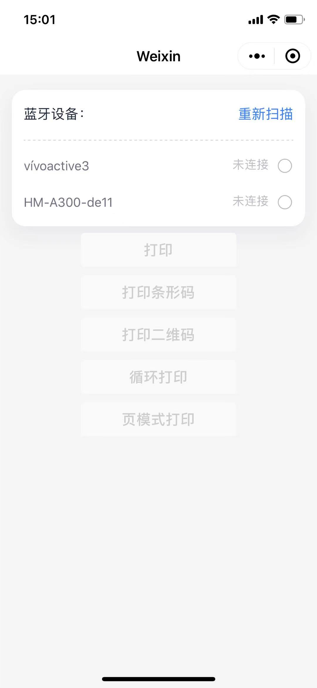

# 微信小程序蓝牙打印

基于weui风格的微信小程序蓝牙打印demo。蓝牙打印用的esc/pos标准指令集。

* 测试设备：iPhone 6s/x，小米/三星等。

* 测试打印机：

    * 优博讯（Urovo）： K319-8676L

    * 新北洋（SNBC）：BTP-P32FY

注：因条件限制，目前仅在以上两台打印机下测试通过。理论上其他支持esc/pos指令集的打印机下应该也能完美运行。


### 启动方式：

微信开发者工具引入即可，appid需要在project.config.json里自己配置。

### 效果图：
<div>
    
</div>

### 流程：
**1. wx.closeBLEConnection(断开低功耗蓝牙连接)**  
如果手机之前连过蓝牙设备，首先需要断开。

**2. wx.openBluetoothAdapter(初始化蓝牙模块)**

**3. startBluetoothDevicesDiscovery(搜索蓝牙)**  
来自官方文档的提醒：此操作比较耗费系统资源，请在搜索到需要的设备后及时调用 wx.stopBluetoothDevicesDiscovery 停止搜索。

**4. wx.getBluetoothDevices(获取搜索到的蓝牙设备: devices)**  
获取在蓝牙模块生效期间所有搜索到的蓝牙设备。包括已经和本机处于连接状态的设备。返回一个设备列表devices。
  
**5. 选中需要连接的设备(deviceId)**   
获取需要连接设备的deviceId。

**6. wx.stopBluetoothDevicesDiscovery(停止搜索蓝牙)**  
关闭搜索，释放系统资源。

**7. wx.createBLEConnection(连接低功耗蓝牙设备)**  
连接蓝牙低功耗设备。用第5步中拿到的deviceId去建立低功耗蓝牙连接。

**8. wx.getBLEDeviceServices(获取蓝牙设备所有服务: (deviceId) => services)**  
建立蓝牙连接之后，需要根据deviceId获取该蓝牙设备下所有的服务services。遍历services,找到isPrimary为真值的service(蓝牙设备的主服务)，得到该service的serviceId。

**9. wx.getBLEDeviceCharacteristics(获取蓝牙设备某个服务中所有特征值:(deviceId, serviceId) => characteristicId)**  
获取蓝牙低功耗设备(deviceId)某个服务(serviceId)中所有特征 (characteristics)。遍历characteristics，找到properties.write为真值的characteristicId。因为设备的特征支持 write 才可以写入数据。

**10. wx.writeBLECharacteristicValue(打印)**  
现在我们已经拿到了蓝牙设备的deviceId,serviceId,characteristicId，接下来只要把我们要打印的内容转换成蓝牙设备能识别的二进制数据，并向低功耗蓝牙设备特征值中写入即可。
由于用的是低功耗蓝牙，写入的数据需要进行分包发送，具体实现见demo。  
内容转换根据打印设备支持的指令集不同而不同。
指令集一般包括打印机设置和操作，打印内容配置等。一般打印设备出厂都有专门指令集文档支持，类似于浏览器，不同厂商对于标准的执行不一而足，需要认真阅读文档。

**11.离开页面时取消蓝牙连接 wx.closeBLEConnection**

**12.关闭蓝牙模块 wx.closeBluetoothAdapter**


### 文件结构

```
.
├── app.js
├── app.json
├── app.wxss
├── image                 // README.md用到的图片
├── package.json
├── project.config.json
├── pages                 
│   └─index               // demo文件
│     ├──index.js
│     ├──index.wxml
│     └──index.wxss
└── utils                 // 公共方法
    ├── encoding          // 编码方法
    ├── bluetooth.js      // 蓝牙调用方法
    ├── commands.js       // 指令集
    └── printerjobs.js    // 公共打印方法
```
 
### 注意：
1. 打印中文需要使用[text-encoding](https://github.com/inexorabletash/text-encoding)进行编码。考虑到微信小程序包的大小限制，对text-encoding进行了精简，只保留了**gb2312**编码方式。
2. 通过低功耗蓝牙向设备传输数据过大时，为了防止写入失败的情况，需要对写入数据做分包处理。具体见[小程序官方文档](https://developers.weixin.qq.com/miniprogram/dev/api/device/bluetooth-ble/wx.writeBLECharacteristicValue.html)。
3. 部分安卓机型如果已经连上某个蓝牙设备，直接连另一个蓝牙设备，会已连接的错误，需要先断开再连接。iOS暂没有发现这个问题。demo里针对安卓机型已处理。
4. 目前本demo打印对于条形码打印的支持还不是很全面，可以认为目前只支持纯数字。
5. 目前本demo还不支持打印图片。


### 参考：
* [微信小程序蓝牙官方api](https://developers.weixin.qq.com/miniprogram/dev/api/device/bluetooth-ble/wx.writeBLECharacteristicValue.html)
* [微信小程序蓝牙打印简明介绍](https://www.jianshu.com/p/05d939060373)
* [GitHub Demo - miniprogram-bluetoothprinter](https://github.com/benioZhang/miniprogram-bluetoothprinter)
* [GitHub Demo - node-escpos](https://github.com/song940/node-escpos)
* [Epson打印机ESC/POS指令大全](https://reference.epson-biz.com/modules/ref_escpos/index.php?content_id=2)

